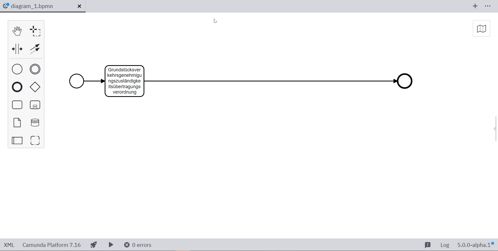

# Camunda Modeler Plugin: Resize Tasks

A Camunda Modeler plugin that makes tasks resizable. In case your _Grundstücksverkehrsgenehmigungszuständigkeitsübertragungsverordnung_ doesn't fit.



## Building

Install dependencies:

```sh
npm install
```

Package plugin to `client/client-bundle.js`:

```sh
npm run bundle

# or

npm run bundle:watch
```

## Additional Resources

* [Plugins documentation](https://github.com/camunda/camunda-modeler/tree/master/docs/plugins)

# Licence

MIT